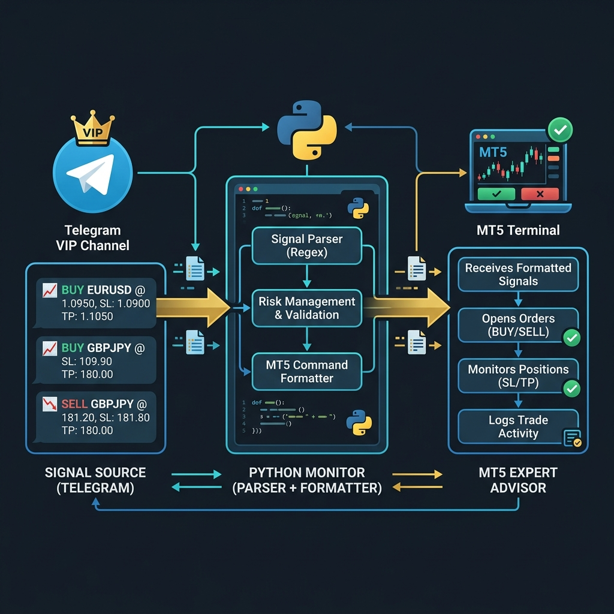
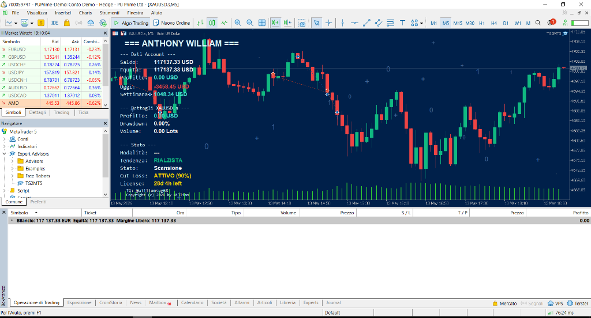
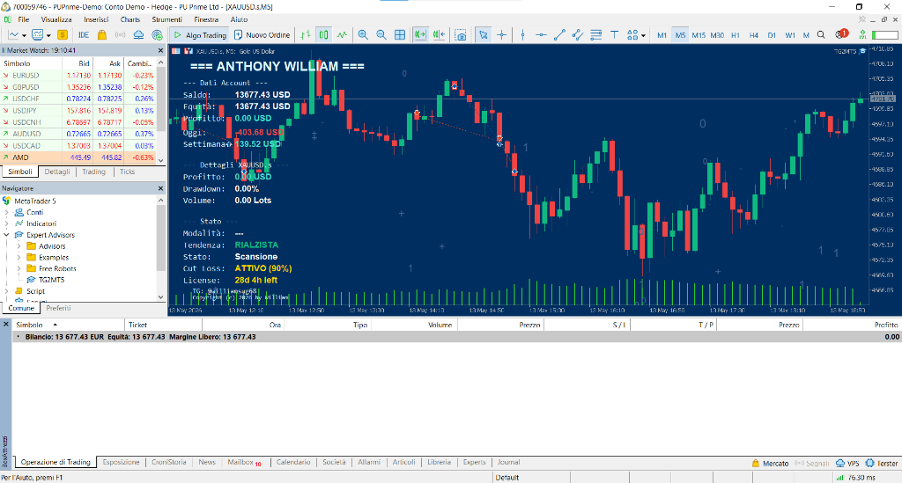
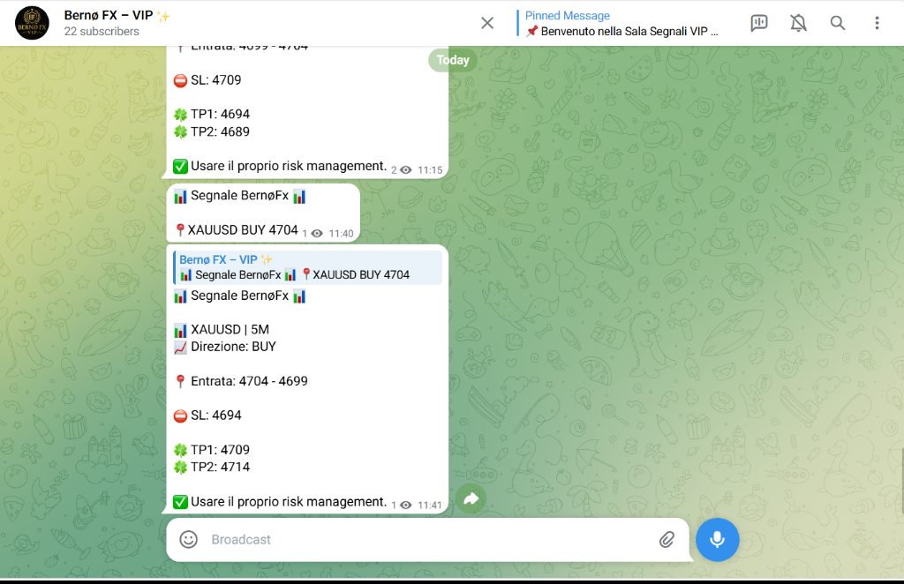

<p align="center">
  
</p>

<h1 align="center">📡 TG2MT5 — Telegram Signal Copier for MetaTrader 5</h1>

<p align="center">
  <strong>Automated Signal Mirroring · Dual Take-Profit · VIP Channel Management · 24/7 Execution</strong>
</p>

<p align="center">
  
  
  
  
  
</p>

---

## 📖 Overview

**TG2MT5** is a production-grade automated trading system that bridges **Telegram signal channels** with **MetaTrader 5**. It monitors premium VIP signal providers in real-time, processes trading signals, and executes them with automated risk management — all running 24/7 on a Windows VPS.

### 🎯 What It Does

1. 📡 **Monitors** Telegram VIP channels for trading signals 24/7
2. 🧠 **Classifies** 7+ types of market messages with advanced NLP-based parsing
3. 🔍 **Filters** signals using multi-channel whitelist system
4. ⚡ **Executes** trades on MetaTrader 5 with precise order management
5. 📊 **Manages** partial closes with dual Take-Profit strategy
6. 🔄 **Mirrors** and reformats signals to client VIP channels
7. 🛡️ **Protects** against duplicates with multi-layer deduplication

---

## 🏗️ System Architecture

```
┌─────────────────────┐     ┌──────────────────────┐     ┌─────────────────────┐
│  Signal Provider    │     │   Python Monitor     │     │   MT5 Terminal      │
│  (Telegram VIP)     │────▶│                      │────▶│                     │
│                     │     │  ● Signal Parser     │     │  ● Expert Advisor   │
│  SIGNAL ALERT       │     │  ● VIP Classifier    │     │  ● Auto Lot Size   │
│  TP1/TP2 HIT       │     │  ● Deduplication     │     │  ● Partial Close    │
│  SL HIT             │     │  ● Mirror System     │     │  ● SL Management   │
│  RUNNING/CLOSED     │     │  ● Whitelist Filter  │     │  ● Anti-Spam       │
└─────────────────────┘     │  ● State Manager     │     └─────────────────────┘
                            │  ● Edit Tracker      │
                            │         │            │
                            └─────────┼────────────┘
                                      │
                                      ▼
                            ┌──────────────────────┐
                            │  Client VIP Channel  │
                            │  (Formatted Output)  │
                            │                      │
                            │  Professional Signal │
                            │  Mirroring System    │
                            └──────────────────────┘
```

---

## 📸 Live Screenshots

### MT5 — Account $100K (PU Prime)
<p align="center">
  
</p>

> **Balance: $117,137** · EA: ANTHONY WILLIAM · Status: ATTIVO (90%) · Tendenza: RIALZISTA

### MT5 — Account $10K (PU Prime)
<p align="center">
  
</p>

> **Balance: $13,677** · EA: ANTHONY WILLIAM · Status: ATTIVO (90%) · Cut Loss protection enabled

### Bernø FX — VIP Channel (Live Signal Forwarding)
<p align="center">
  
</p>

> Signal forwarding from source to client VIP channel with Italian formatting and reply-linked updates.

---

## ✨ Key Features

### 🔄 Telegram Monitor (Python)
| Feature | Description |
|---------|-------------|
| **Multi-Channel Support** | Monitor multiple signal providers simultaneously |
| **7-Type Classifier** | signal, tp1/tp2_hit, sl_hit, approaching, running, closed |
| **Advanced Dedup** | Message ID + MD5 hash + edit tracking |
| **VIP Mirroring** | Auto-forward formatted signals to client channels |
| **Edit Detection** | Track and update edited messages in real-time |
| **Whitelist Filter** | Only process approved signal patterns |
| **State Persistence** | Trade state survives bot restarts |
| **Auto-Restart** | 5-second recovery loop for 24/7 uptime |
| **Windows Service** | One-click install as background service |

### ⚡ MT5 Expert Advisor (MQL5)
| Feature | Description |
|---------|-------------|
| **Auto Lot Sizing** | Dynamic calculation based on account balance |
| **Dual Take-Profit** | Partial close at TP1, full close at TP2 |
| **SL Management** | Automatic break-even after TP1 hit |
| **Price Deviation Filter** | Reject stale signals beyond threshold |
| **Cooldown Protection** | Minimum interval between orders |
| **Duplicate Detection** | Active position scanning |
| **On-Chart Dashboard** | Real-time status display |
| **Error Recovery** | Comprehensive retry and error handling |

---

## 🎯 Trading Logic

### Dual Take-Profit Strategy

```
Signal: SELL XAUUSD @ 3350.00
SL: 3362.50 | TP1: 3337.50 | TP2: 3325.00
Account: $50,000 → Lot: 1.50
```

| Event | Action | Volume | SL |
|-------|--------|--------|----|
| **Open** | SELL 1.50 lot | 1.50 | 3362.50 |
| **TP1 Hit** | Close 50% (0.75 lot) | 0.75 | → 3350.00 (BE) |
| **TP2 Hit** | Close remaining | 0.00 ✅ | Complete |

### Deduplication Pipeline

```
Message → [Layer 1: Message ID] → [Layer 2: MD5 Hash 60s] → [Layer 3: Cooldown] → [Layer 4: Position Scan] → Execute
```

---

## 🛠️ Tech Stack

| Component | Technology |
|-----------|-----------|
| **Signal Monitor** | Python 3.11 + Telethon |
| **Message Parser** | Regex-based multi-pattern classifier |
| **Trade Execution** | MQL5 Expert Advisor (83K+ lines) |
| **State Management** | JSON persistence layer |
| **Deployment** | Windows VPS + Scheduled Task |
| **Communication** | Shared file bridge (`signal.txt`) |

---

## 📂 Project Structure

```
TG2MT5/
├── MT5_EA/
│   └── TG2MT5.mq5                  # Expert Advisor (83K+ lines)
├── TG_parser/
│   ├── config.py                    # Channel & API configuration
│   ├── tg_monitor_production.py     # Production monitor (55K lines)
│   ├── check_channels.py           # Channel discovery utility
│   ├── get_channel_info.py         # Channel info retriever
│   ├── requirements.txt            # Dependencies
│   ├── start_monitor.bat           # Auto-restart launcher
│   ├── install_service.bat         # Service installer
│   ├── uninstall_service.bat       # Service removal
│   └── check_status.bat            # Health check
├── docs/
│   └── *.png                       # Documentation images
└── README.md
```

---

## 🔧 Production Deployment

### Requirements
- Python 3.11+ with Telethon
- MetaTrader 5 Terminal
- Windows VPS (recommended: ForexVPS)
- Telegram API credentials

### Deployment Checklist
- [x] Python environment setup
- [x] Telegram authentication
- [x] Channel configuration
- [x] MT5 EA compilation & attachment
- [x] Windows Service registration
- [x] Health monitoring configured

---

## 🔐 Security

- API credentials stored in separate config (not committed)
- Session files excluded from version control
- Telegram authentication via phone OTP
- Windows Service runs under limited account

---

## ⚠️ Disclaimer

> This is a **showcase repository**. Source code is not included.
> This system is deployed in production for a private client.
> For inquiries about similar solutions, contact **VQuant Development**.

---

## 📄 License

All rights reserved. This software is proprietary and confidential.

---

<p align="center">
  <strong>Built with ❤️ by VQuant</strong>
  <br/>
  <em>Automated Trading Solutions</em>
</p>
